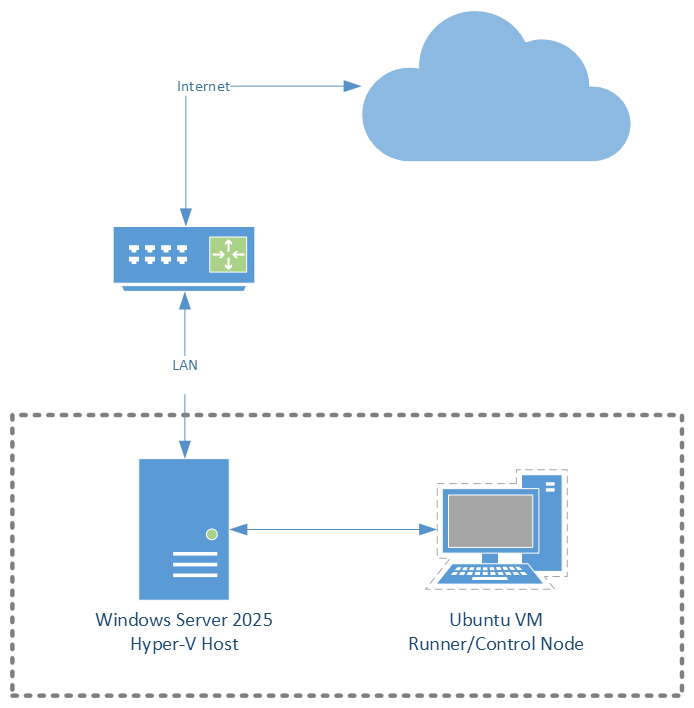

# Dark Mesa Security
This project is a modified version of an infrastructure exercise given to students studying System Specialist at Utbilndning Nord. I intend to solve the exercise using IaC and DevOps principles. The original instructions of the exercise can be found in [this document](docs/OriginalExercise.md).

## Status and Progress
 - 

1. [ ] Research and preparation
2. [ ] Building infrastructure
3. [ ] Deployment automation fine tuning

## Goals
With this project I intent to take what I have learned in my studies at Utbilding Nord and use it to solve this exercise. Most of the skills I need to use I have practiced individually in earlier labs, but by doing this project I get to combine them in one single project.  

Ideally I would do this in Azure, but since I expect there to be a lot of trial and error, the few credits I have left would fly by quite fast. I've set the main goal to be to deploy the infrastructure on a local Windows Server running Hyper-V.

## Project phases
I've split the project into several phases with different goals. I do not expect to finish all these before I reach end of my studies in august, but I hope to finish phase 2 before I leave. 

### Research and preparation
Research and decide what tools to use, how to structure the project, and test deployment using the tools and GitOps methods.
This phase is done after I can deploy different working infrastructure types using Actions:
- External and Private virtual switch
- pfSense router with config
- VM running Windows installed using Packer, and configured using Ansible.

### Building infrastructure
Create templates for the infrastructure, images, and configuration required for the exercise, then deploy it to the host using GitHub Actions.

### Deployment automation fine tuning
Make sure everything can be deployed to a freshly installed server using scripts and code from this repository.

### Bonus Goals
Some goals for further learning.
- [ ] Convert and deploy to Azure
- [ ] Configure monitoring

## Physical infrastructure

I have one Hyper-V host running Windows Server 2025, and I currently run a VM on that host as the control node. The host is configured to allow SSH with certificate based authentication and WinRM over HTTPS.