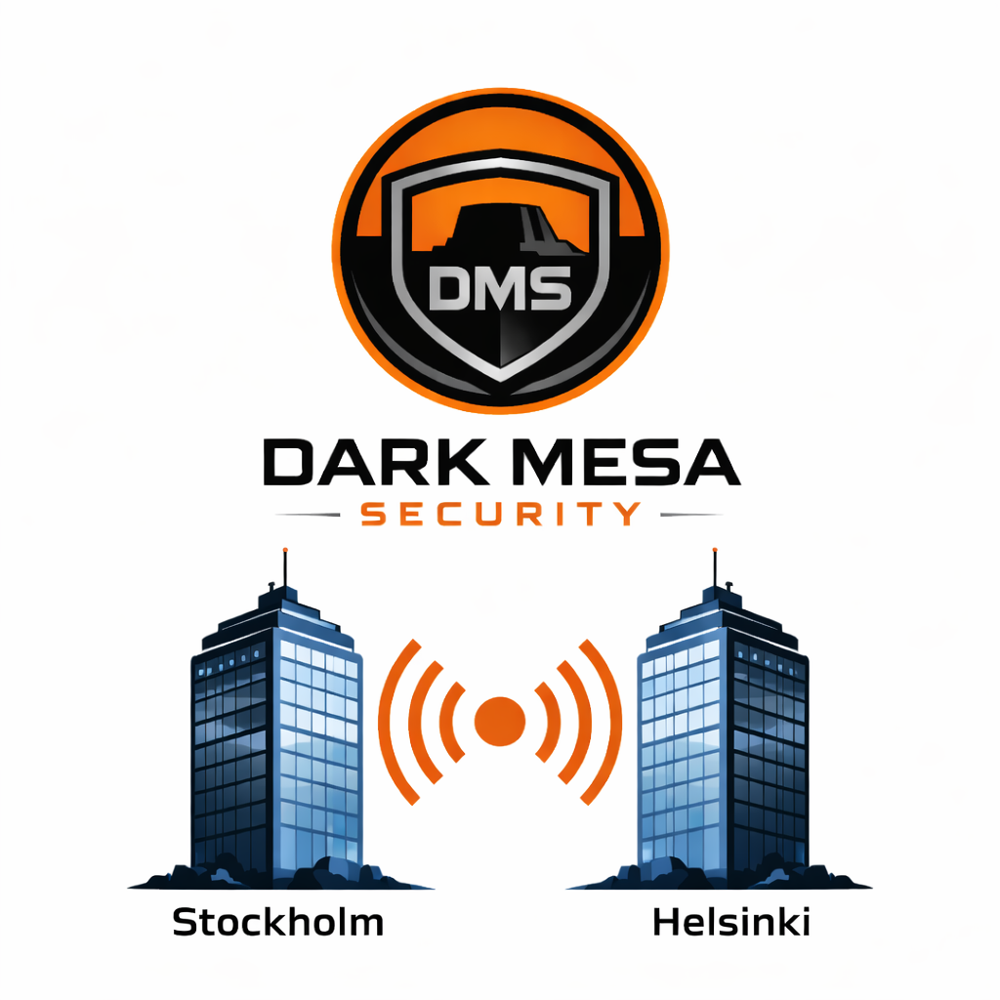
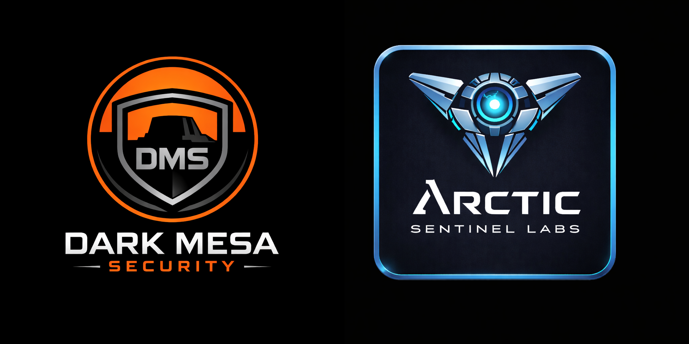
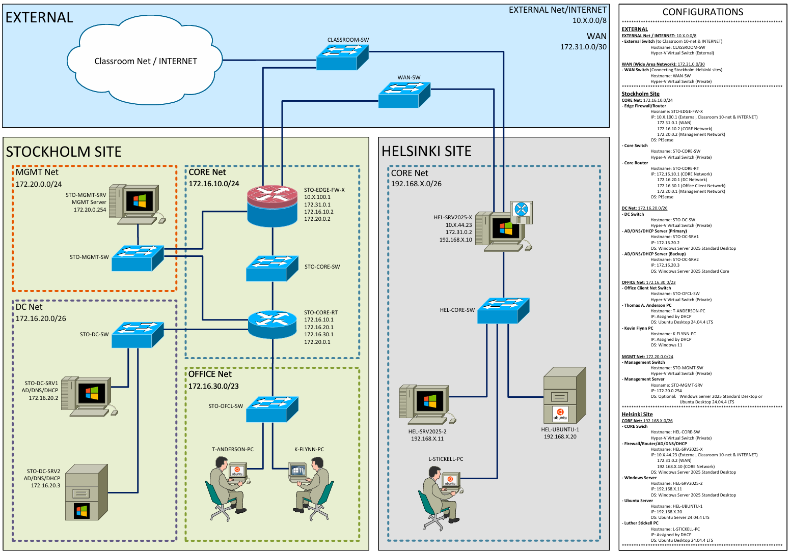

# Introduction
In this exercise you will setup a corporate network and datacenter for an imaginary company called Dark Mesa Security. You will install and configure the following functions for Dark Mesa Security:

- Firewalls
- Routers
- Subnets for different functionalities in the company
- Active Directory/DNS/DHCP Server with redundancy
- Workstations for employees
- and more!

The goal of this exercise is for you to apply all the skills you have learned in the courses A+, Server+ and Network+. Therefore, you will only be given high level instructions and mandatory configurations. The Outcome section describes what you need to hand in when you are done.

***

# Synopsis
Dark Mesa Security, headquartered in Stockholm, is a Nordic cybersecurity firm focused on protecting critical digital infrastructure and high-value research environments. The company specializes in advanced network defense, threat intelligence, and security architecture designed to anticipate and counter emerging cyber threats.

As part of its expansion into advanced security research, Dark Mesa Security acquired Arctic Sentinel Labs, a Helsinki-based cybersecurity research group known for its expertise in vulnerability discovery and deep system analysis. Operating as Dark Mesa’s dedicated research division, Arctic Sentinel Labs develops new defensive methodologies, analyzes emerging attack techniques, and explores next-generation security technologies.

Together, Dark Mesa Security and Arctic Sentinel Labs combine operational expertise with forward-looking research to stay ahead of an increasingly complex threat landscape.

***

# Table of Content
- [Introduction](#introduction)
- [Synopsis](#synopsis)
- [Table of Content](#table-of-content)
- [Assignments](#assignments)
- [Outcomes](#outcomes)
- [Wide Area Network Topology](#wide-area-network-topology)
- [Network Topology](#network-topology)
- [Technical Requirements](#technical-requirements)
- [STO-DC Server Roles](#sto-dc-server-roles)
- [HEL-SRV2025-X Server Roles](#hel-srv2025-x-server-roles)
- [HEL-UBUNTU-1 Server Roles](#hel-ubuntu-1-server-roles)
- [Virtual Machine (VM) Configurations](#virtual-machine-vm-configurations)
- [Virtual Switch Configurations](#virtual-switch-configurations)
- [Organizational Units and Security Groups in Active Directory](#organizational-units-and-security-groups-in-active-directory)
- [User Accounts](#user-accounts)
- [Group Policy Objects, GPOs](#group-policy-objects-gpos)
- [File Shares](#file-shares)
- [Reference Documentation](#reference-documentation)

***

# Assignments
## Mandatory
- Setup all VM's and network according to the section Network Topology
    - You will find the VM specifications in the section Virtual Machine (VM) configurations
    - You will find the switch specifications in the section Virtual Switch Configurations

- Setup routing and firewalls according to instructions in the Technical Requirements section

- Setup the AD/DNS/DHCP/NTP servers according to instructions in STO-DC Server Roles and HEL-SRV2025-X Server Roles

- Setup a project folder on HEL-UBUNTU-1 according to instructions in section HEL-UBUNTU-1 Server Roles

- Setup Active Directory Organizational Units and Security Groups according to instructions in section Organizational Units and Security Groups in Active Directory

- Setup User Accounts for all users according to instructions in section User Accounts

## Extra Work (if time)
- Create the Central Store for Group Policy Administrative Templates

- Implement group policies according to instructions in section Group Policy Objects, GPOs

- Create file shares and set permissions according to instructions in section File Shares

***

# Outcomes
Hand in the following once you have completed all the assignments:

- A-record for hosts on STO-DC-SRV1 and HEL-SRV2025-X
    - Run 
    > `Get-DnsServerResourceRecord -ZoneName "example.com" | ? RecordType -eq "A"`

    in PowerShell and hand in a screenshot of the results from both servers

- Show properties of the DHCP scopes for STO-DC-SRV1
    - Run 
    > `Get-DhcpServerv4Scope | ForEach-Object {Get-DhcpServerv4OptionValue -ScopeId $_.ScopeId -OptionId 3,6,15 | Select-Object @{n="Scope";e={$_.ScopeId}}, OptionId, Name, Value}`
    
    in PowerShell and hand in a screenshot of the result

- Show the failover relationship between STO-DC-SRV1 and STO-DC-SRV2
    - Run 
    > `Get-DhcpServerv4Failover on STO-DC-SRV1 and screenshot the result`

- Show all users in the Active Directory
    - Run 
    > `Get-ADUser -Filter * -Properties MemberOf, Department, Company, Manager | Select-Object Name, @{n="OU";e={($_.DistinguishedName -split ',',2)[1]}}, Department, Company, @{n="Manager";e={ if ($_.Manager) { ($_.Manager -split ',')[0] -replace '^CN=' } }}, @{n="Groups";e={($_.MemberOf | ForEach-Object { ($_ -split ',')[0] -replace '^CN=' }) -join '; '}} | Export-Csv "$env:USERPROFILE\Desktop\users_full.csv" -NoTypeInformation`

    on STO-DC-SRV1 and HEL-SRV2025-X and upload the users_full.csv files. The .csv files can be found directly on the desktop of each VM

- Show all FW rules implemented on STO-EDGE-FW-X and STO-CORE-RT
    - Screenshot and upload all the FW rules implemented on both pfSense routers. Remember that you may have different rules on different interfaces on both machines

- Show all static routes implemented on STO-FW-EDGE-X and STO-CORE-RT
    - Screenshot all static routes implemented on both pfSense routers.

- Show WinSCP functionality between K-FLYNN-PC and HEL-UBUNTU-1
    - Open WinSCP on K-FLYNN-PC and connect to HEL-UBUNTU-1. Take a screenshot of the Project-T folder, it should contain the file project-t-synopsis.txt

***

# Wide Area Network Topology
Dark Mesa Security is based in Stockholm and after the acquisition of Arctic Sentinel Labs they need a WAN link between the two headquarters. Each office has their own connection to the Internet. Your job is to setup the network between the two headquarters in a robust and secure way.

***

# Network Topology
Each site is running its own Active Directory/DNS/DHCP server. The Helsinki site has only one internal subnet. The Stockholm site is much larger and has several internal subnets for different functions. Your job is to setup the networks for each site according to the network map below. You may reuse the VM's created in the labs for the Server+ course for the Helsinki site, but pay attention that some machines will need to be modified to match the network map. For the Stockholm site you must create new VM's.

***

# Technical Requirements
## IP Address, Domain- and Hostnames
- All servers must have static IP address
- All workstations must have DHCP address
    - Stockholm workstations must have DHCP from STO-DC-SRV1 or STO-DC-SRV2 
    - Helsinki workstations must have DHCP form HEL-SRV2025-X
- All machines must be domain joined
    - All machines on Stockholm site must have domain DarkMesa-X.local, where X is your number in the Classroom IP Scheme. Example domain name could be DarkMesa19.local
    - All machines on Helsinki site must have domain ASL-X.local, where X is your number in the Classroom IP Scheme. Example domain name could be ASL-19.local
    - pfSense machines do not have to be domain joined
- All machines must have correct hostname. Gateway devices have hostnames ending with -X. X should be replaced with your number in the Classroom IP Scheme. Example hostnames can be:
    - STO-EDGE-FW-19
    - HEL-SRV2025-19
## NAT-rules
- Only gateway devices may be connected to the Internet
- Other devices that needs Internet connection must be NAT:ed throught the gateway devices
- NAT should only be done on the gateway devices (STO-EDGE-FW-X and HEL-SRV2025-X)

## FW-rules
### General Instructions
- All FW-rules on pfSense machines must use aliasing. You are not allowed to set FW-rules with direct IP addresses
- Remember that the firewall rules on the pfSense machines are triggered when the traffic comes in to the interface, not when it's going out
- FW-rules are triggered in the order in which they are configured, top- to bottom. Pay attention in which order you place the FW-rules for correct behavior
- You can test FW rules by using ping from different machines to different networks. Check FW on pfSense machines to see if there are any hits on your rules, you can use different filters to easily see the traffic you are testing

## WAN Link
- This is the direct link between Helsinki office and Stockholm headquarters
- This network is only for routing between the two sites
- This network should not have Internet access

## Stockholm Headquarters
### MGMT Net
- **Pro-tip:** pfSense automatically sets the webinterface to the LAN adapter. Set LAN -> MGMT net and connect to the webinterface on pfSense through STO-MGMT-SRV
- **Note!** The default login credentials to the pfSense webinterface is admin/pfsense
- This network is only used for backend management of routers, firewalls and servers.
- This network must therefore be extra restricted
    - MGMT Net must not be connected to the internet
    - All incoming traffic from other networks must be blocked, except AD/DNS/NTP

### CORE Net
- This is the DMZ between internal networks and connections to WAN and INTERNET

### DC Net
- This is the Datacenter network. It is used for different servers such as AD/DNS/DHCP/NTP servers, file servers for shared storage, etc.
- This network is only for internal use at Stockholm. Access from Helsinki networks and WAN should be blocked
- DC Net should have internet access for security updates etc.
- DC Net should be accessible from OFFICE Net and MGMT Net

### OFFICE Net
- This is the workstation network for employees at Dark Mesa Security
- This network should have Internet access
- This network should be accessible from Helsinki CORE Net so that the employees at Helsinki can collaborate with the workers at Stockholm

## Helsinki Office
### CORE Net
This is the internal network at Helsinki office
- This network should allow access from Stockholm OFFICE Net so that the employees at Stockholm can collaborate with the employees at Helsinki

***

# STO-DC Server Roles
These are the main AD/DNS/DHCP/NTP servers for the Stockholm headquarters.

- STO-DC-SRV2 is used as backup for STO-DC-SRV1. If STO-DC-SRV1 fails you should still have fully functional AD/DNS/DHCP/NTP services
    - You can simulate a server failure by either turning off the ethernet interface on STO-DC-SRV1 or just turning the entire machine off
- AD:
    - Use DarkMesa-X.local as domain name, where X is your number in the Classroom IP Scheme. Example domain name could be DarkMesa-19.local
    - All machines at Stockholm site must be domain joined, except the pfSense machines
    - Create Organizational Units (OU) and Security Groups (SG). An organizational table and more detailed instructions are found further down in this page
- DNS:
    - Add reverse lookup zones for your subnets on the DNS servers
    - Use 10.0.0.10 as forwarder for the DNS servers
- DHCP: 
    - All workstations at OFFICE Net should use DHCP 
    - Use entire OFFICE Net as scope
    - Configure the relationship between STO-DC-SRV1 and -SRV2 as load balance
    - Use STO-CORE-RT as router
    - Remember to configure DHCP forwarding on STO-CORE-RT
    - Remember to set correct DNS server(s) for the DHCP scope
- NTP:
    - STO-DC-SRV1/2 should use 10.0.0.1 as NTP source
    - All remaining machines at Stockholm site should use STO-DC-SRV1 and STO-DC-SRV2 as NTP source

***

# HEL-SRV2025-X Server Roles
This is the AD/DNS/DHCP/NTP server used at the Helsinki location. This is a smaller office without any backup server.

- AD:
    - Use ASL-X.local as domain name, where X is your number in the Classroom IP Scheme. Example domain name could be ASL-19.local
    - All machines at Helsinki site must be domain joined
    - Follow the same AD practice as for the Stockholm site. Organizational table and instructions are found further down in this page
- DNS:
    - Add reverse lookup zones for your subnets on the DNS servers
    - Use 10.0.0.10 as forwarder for the DNS servers
- DHCP:
    - Scope: 192.168.X.31 - 192.168.X.40
    - Netmask: 255.255.255.192 (/26)
    - Gateway/Router: 192.168.X.10
    - DNS: 192.168.X.10
- NTP:
    - HEL-SRV2025-X should use 10.0.0.1 as NTP source
    - All other machines at Helsinki site should use HEL-SRV2025-X as NTP source

***

# HEL-UBUNTU-1 Server Roles
- Create a user account for Kevin Flynn from Stockholm Headquarters on HEL-UBUNTU-1
- Create a folder in HEL-UBUNTU-1 called Project-T. Create a user group called project_t and set full permissions to the folder Project-T to this group. Add Kevin Flynn to group project_t
- Download and install WinSCP on K-FLYNN-PC
- Use WinSCP from K-FLYNN-PC to create a text file called project-t-synopsis.txt in Project-T folder on HEL-UBUNTU-1

***

# Virtual Machine (VM) Configurations
The table below shows the configurations of the virtual machines.

| Hostname           | Gen. | RAM [MB] | Dyn. RAM | Disk Size [GB] | No. of Virtual Processors | Operating System                          | IP Address                                 | Network Size | Network Name            |
|--------------------|------|----------|----------|----------------|---------------------------|-------------------------------------------|--------------------------------------------|-------------|--------------------------|
| STO-EDGE-FW-X      | 1    | 2048     | Yes      | 12             | 2                         | pfSense                                   | 10.X.100.1                                  | /8          | EXTERNAL Net/INTERNET   |
|                    |      |          |          |                |                           |                                           | 172.31.0.1                                  | /30         | WAN Net                 |
|                    |      |          |          |                |                           |                                           | 172.16.10.2                                 | /24         | CORE Net                |
|                    |      |          |          |                |                           |                                           | 172.20.0.2                                  | /24         | MGMT Net                |
| STO-CORE-RT        | 1    | 2048     | Yes      | 12             | 2                         | pfSense                                   | 172.16.10.1                                 | /24         | CORE Net                |
|                    |      |          |          |                |                           |                                           | 172.16.20.1                                 | /26         | DC Net                  |
|                    |      |          |          |                |                           |                                           | 172.16.30.1                                 | /23         | OFFICE Net              |
|                    |      |          |          |                |                           |                                           | 172.20.0.1                                  | /24         | MGMT Net                |
| STO-MGMT-SRV       | 2    | 2048     | Yes      | 40             | 2                         | Windows Server 2025 / Ubuntu 24.04 LTS     | 172.20.0.254                                | /24         | MGMT Net                |
| STO-DC-SRV1        | 2    | 2048     | Yes      | 40             | 2                         | Windows Server 2025 Desktop                | 172.16.20.2                                 | /26         | DC Net                  |
| STO-DC-SRV2        | 2    | 2048     | Yes      | 40             | 1                         | Windows Server 2025 Core                   | 172.16.20.3                                 | /26         | DC Net                  |
| T-ANDERSON-PC      | 2    | 2048     | Yes      | 30             | 2                         | Ubuntu Desktop 24.04.4 LTS                | DHCP                                       | n/a         | OFFICE Net              |
| K-FLYNN-PC         | 2    | 4096     | Yes      | 70             | 2                         | Windows 11 Pro                            | DHCP                                       | n/a         | OFFICE Net              |
| HEL-SRV2025-X      | 2    | 2048     | Yes      | 40             | 2                         | Windows Server 2025 Desktop                | 10.X.44.23 / 172.31.0.2 / 192.168.X.10       | /8 /30 /26  | INTERNET / WAN / CORE   |
| HEL-SRV2025-2      | 2    | 2048     | Yes      | 40             | 2                         | Windows Server 2025 Desktop                | 192.168.X.11                                | /26         | CORE Net (Helsinki)     |
| HEL-UBUNTU-1       | 2    | 1024     | Yes      | 20             | 1                         | Ubuntu Server 24.04.4 LTS                 | 192.168.X.20                                | /26         | CORE Net (Helsinki)     |
| L-STICKELL-PC      | 2    | 2048     | Yes      | 30             | 2                         | Ubuntu Desktop 24.04.4 LTS                | DHCP                                       | n/a         | CORE Net (Helsinki)     |

***

# Virtual Switch Configurations
The table below shows the configurations of the virtual switches. Pay attention to the switch types; only the CLASSROOM switch is external, all other switches are private.
| Hostname        | Site       | Type                            | Network                  | IP Range       |
|-----------------|------------|----------------------------------|--------------------------|----------------|
| CLASSROOM-SW    | Both       | Hyper-V Virtual Switch: External | EXTERNAL Net/INTERNET    | 10.X.0.0/8     |
| WAN-SW          | Both       | Hyper-V Virtual Switch: Private  | WAN Net                  | 172.31.0.0/30  |
| STO-CORE-SW     | Stockholm  | Hyper-V Virtual Switch: Private  | CORE Net                 | 172.16.10.0/24 |
| STO-MGMT-SW     | Stockholm  | Hyper-V Virtual Switch: Private  | MGMT Net                 | 172.20.0.0/24  |
| STO-DC-SW       | Stockholm  | Hyper-V Virtual Switch: Private  | DC Net                   | 172.16.20.0/26 |
| STO-OFCL-SW     | Stockholm  | Hyper-V Virtual Switch: Private  | OFFICE Net               | 172.16.30.0/23 |
| HEL-CORE-SW     | Helsinki   | Hyper-V Virtual Switch: Private  | CORE Net                 | 192.168.X.0/26 |

***

# Organizational Units and Security Groups in Active Directory
## General Instructions
- Organizational Units is only used for structure
- Security Groups are used for permissions
- Use the **AGDLP** practice:
    - **A** = Accounts (users, computers) goes to **G** = Global groups
    - G goes to **DL** = Domain Local groups
    - **P** = Permissions, set for DL groups
## Organizational Units, OUs
Use the following high-level order for both Stockholm and Helsinki sites:
- Users
    - **Note!** Create a new OU for your users and name it for example DMS-Users. You can't create sub-OU's in the built-in Users CN. Do not try to delete the built-in Users CN!
    - Create sub-OU's for different departments (i.e. Sales, HR, IT, Prod., etc.) and put user accounts here
- Computers
    - **Note!** Create a new OU for your computers and name it for example DMS-Computers. You can't create sub-OU's in the built-in Computers CN. Do not try to delete the built-in Computers CN!
    - Create sub-OU's for
        - Workstations
            - Create sub-OU's for different departments (i.e. Sales, HR, IT, Prod., etc.)
        - Servers
            - Create sub-OU's for different functions (i.e. Infrastructure, Applications, Network, etc.)
- Domain Controllers
    - This is created by default when setting up Active Directory. Do not change this
- Groups
    - Create this separate OU for your security groups. You do not want Group Policy Objects to interfere with your Security Groups
    - Create sub-OU's for
        - Global
            - Put your Global security groups here
        - Domain Local
            - Put your Domain Local security groups here

## Security Groups
Use the following naming convention for your Security Groups:
- Global groups: G_<department>_<position>
- **G** = Global group 
- **department** should be where the employee works, i.e. HR, Sales, IT, Prod., etc.
- **position** is the employee's position in their department, i.e. MGMT, LEAD, TEAM, etc.
- Example Global group could be **G_IT_TEAM**, which corresponds to IT Team members
- **Note!** higher positions can belong to lower position groups but not vice versa. You should use nested groups to set permissions in this case, for example G_IT_LEAD can be a member of G_IT_TEAM. An IT Team Leader added to the group G_IT_LEAD will then get all the permissions of the IT Team plus the extra permissions required for the Team Leader
- Domain Local groups: DL_<target>_<permission>
- **DL** = Domain Local
- **target** is the target object(s) to which the permissions are going to be set
permission is the level of permission that is given to the target, i.e. RW = Read & Write, RO = Read Only
- Example Domain Local group could be DL_FS_Sales_RW, which corresponds to Domain Local group - File Share - Sales - Read & Write

***

# User Accounts
## General Instructions
- Create user accounts for all users in the Organizational Table
- Account names should use the following naming convention: username = <first name>.<last name>, for example Marja-Terttu Kondo will have username marja-terttu.kondo
    - Avoid usage of special characters in usernames such as "å ä ö", replace "å" with "a", "ä" with "a", "ö" with "o", etc.
- The following Organization properties must be set for all users: Department, Company, Manager
- Each user must be put in the correct Organizational Unit
- Each user must be put in the correct Security Group
    - Each user must be put in only one Security Group, membership of other groups should be implemented via group nesting
- **Pro-tip 1:** Because there is a long list of users to create, it might be wise to create a template user first, set common properties in the template and then utilize the template for actual user account creation
- **Pro-Tip 2:** There is a template script called addUsers.ps1 and a .csv file called prod_accounts.csv at the end of this page. You can download and modify the script and .csv file and use them to add multiple users at once

## Organizational Table
| Office     | Department | Unit             | Title              | First Name  | Last Name   |
|------------|------------|------------------|--------------------|-------------|-------------|
| Stockholm  | Management |                  | CEO                | Marja-Terttu| Kondo       |
| Stockholm  | HR         | Management       | Manager            | Anna        | Sandell     |
| Stockholm  | HR         | HR Team          | Team Member        | Nadja       | Seppala     |
| Stockholm  | HR         | HR Team          | Team Member        | Nelly       | Wahlberg    |
| Stockholm  | Sales      | Management       | Manager            | Iris        | Peltola     |
| Stockholm  | Sales      | Sales Team       | Team Member        | Gabe        | Stark       |
| Stockholm  | Sales      | Sales Team       | Team Member        | Harrison    | Solo        |
| Stockholm  | IT         | Management       | Manager            | Mace        | Jackson     |
| Stockholm  | IT         | Network Services | Team Member        | Koji        | Newell      |
| Stockholm  | IT         | Network Services | Team Member        | Chris       | Fujiwara    |
| Stockholm  | IT         | Network Services | Team Member        | Eiji        | Harrington  |
| Stockholm  | IT         | Server Admin     | Team Member        | Paul        | Jobs        |
| Stockholm  | IT         | Server Admin     | Team Member        | Bill        | Wozniak     |
| Stockholm  | Prod       | Management       | Manager            | Anthony     | Torvalds    |
| Stockholm  | Prod       | Team Alpha       | Team Leader        | John        | Spartan     |
| Stockholm  | Prod       | Team Alpha       | Team Member        | Thomas A.   | Anderson    |
| Stockholm  | Prod       | Team Alpha       | Team Member        | Wade        | Siliäsmaa   |
| Stockholm  | Prod       | Team Alpha       | Team Member        | Linus       | Allas       |
| Stockholm  | Prod       | Team Alpha       | Team Member        | Risto       | Persson     |
| Stockholm  | Prod       | Team Omega       | Team Leader        | Ewan        | Kenobi      |
| Stockholm  | Prod       | Team Omega       | Team Member        | Kevin       | Flynn       |
| Stockholm  | Prod       | Team Omega       | Team Member        | Steve       | Jakobsen    |
| Stockholm  | Prod       | Team Omega       | Team Member        | Kira        | Vikström    |
| Stockholm  | Prod       | Team Omega       | Team Member        | Simona      | Jokinen     |

| Office   | Department | Unit        | Title            | First Name | Last Name |
|----------|------------|------------|------------------|------------|-----------|
| Helsinki | Management |            | Site Manager     | Petri      | Gates     |
| Helsinki | Management |            | HR Consultant    | Saija      | Aonuma    |
| Helsinki | IT         |            | Team Leader      | Alice      | Mikami    |
| Helsinki | IT         |            | Team Member      | Markus     | Allen     |
| Helsinki | DevOps     | Management | Manager          | Gordon     | Freeman   |
| Helsinki | DevOps     | DevOps Team| Team Member      | Mike       | Wilson    |
| Helsinki | DevOps     | DevOps Team| Team Member      | Steve      | Sundqvist |
| Helsinki | DevOps     | DevOps Team| Team Member      | Janika     | Åberg     |
| Helsinki | DevOps     | DevOps Team| Team Member      | Luther     | Stickell  |

***

# Group Policy Objects, GPOs
## Central Store
Use the links below to download the latest Administrative Template files and create the Central Store for Group Policy Administrative Templates
- [Create and Manage Central Store - Windows Client | Microsoft Learn](https://learn.microsoft.com/en-us/troubleshoot/windows-client/group-policy/create-and-manage-central-store)
- [Group Policy Planning and Deployment Guide | Microsoft Learn](https://learn.microsoft.com/en-us/previous-versions/windows/it-pro/windows-server-2008-r2-and-2008/cc754948(v=ws.10))

## General Instructions
- Create a separate GPO for every setting and link the GPO to the corresponding Organizational Unit. The GPOs to be configured are listed in the table further down
- You can create a naming convention for the GPO's on your own, just keep it consistent
    - Example naming convention could be: <Computer / User>-<Template_setting_to_be_changed>-<Enabled / Disabled / Value / Other_info>
    - Example GPO could be: Computer-WindowsUpdate_ConfigureAutomaticUpdates-Enabled

## Requirements
- Do NOT modify the Default Domain Policy
    - Password policy is an exception to this rule
- Do NOT modify the Default Domain Controller Policy
- Create only one GPO with settings related to one Windows feature / system component / etc.

## Table of GPOs
| Setting                     | Description                                                                                                                                     | Technical Requirements |
|-----------------------------|-------------------------------------------------------------------------------------------------------------------------------------------------|------------------------|
| Desktop Background Picture  | Download the DMS-background-1920x1080.png and ASL-background-1920x1080.png files and use as background pictures for workstations at DMS and ASL | - Background picture must only be set to workstations, not to servers - The background picture must be stored on a local file share on each site - Workstations at Stockholm Headquarters must use the DMS background picture - Workstations at Helsinki must use the ASL background picture - The correct background must be shown regardless of which user account is signed in |
| Firewall Rules              | Create a firewall rule that allows all workstations to reply to ping                                                                             |                        |
| Password Settings           | Configure a password policy in Default Domain Policy                                                                                           | - Password must be minimum 10 characters long - Users must change password after 90 days - Users cannot change the password more than once per day |
| Logon message               | Configure a logon message                                                                                                                       | - All workstations at Stockholm Headquarters must have logon message: "Welcome to Dark Mesa Security" - All servers at Stockholm Headquarters must have logon message: "This is a DMS Server" - All workstations at Helsinki Office must have logon message: "Welcome to Arctic Sentinel Labs" - All servers at Helsinki Office must have logon message: "This is an ASL Server" |
| Windows Update              | Configure automatic installation of Windows updates                                                                                             | - Quality updates for Workstations must be automatically downloaded and installed after 1 day of deferral period; install at 03:00 - Workstations must not auto-restart when a user is logged in - Quality updates for Servers must be automatically downloaded and installed after 3 days of deferral period; install at 03:00 |
| Disable Control Panel / Settings | Disable the Control Panel / Settings for all Team Members of HR, Sales and Prod at Stockholm Headquarters                                   | - Only Team Members should be affected by this GPO; Managers and Team Leaders should still have access - This GPO should only affect HR, Sales and Prod at Stockholm Headquarters |

***

# File Shares
You can create file shares for every department on each respective site. You can do this by
- Adding a virtual hard drive on STO-DC1 and HEL-SRV2025-X for file shares
- Create a file share for each department on the respective sites
- Assign permission to each file share by using Security Groups
    - Managers: Full control on all file shares for all departments on own site (i.e. managers on Stockholm site only has access to file shares on Stockholm site, and so on)
    - Team Leaders: Modify access on department file share
    - Team Members: Read and Execute access on department file share
- Security Groups must be used for permissions - Do not use user accounts directly to assign permissions!

If you like, you can add a file server for each site instead of adding a virtual hard drive on STO-DC1 and HEL-SRV2025-X.

***

# Reference Documentation
This section contains a few useful links to get you going with the different services. This is not a comprehensive list, you can find other information both in the labs for Server+ here on Moodle and from other sources online.

## pfSense
Below is the pfSense handbook. You can find all about installation and configuration of pfSense machines in there
- [Preface | pfSense Documentation](https://docs.netgate.com/pfsense/en/latest/preface/index.html)

## Roles and Features in Windows Server DHCP
Below are some useful links about configuring DHCP in Windows Server

- [How to Configure DHCP Relay Agent in Windows Server 2016 - Itechguides](https://www.itechguides.com/dhcp-relay-agent-configuration-in-windows-server-2016/)
- [Step-by-Step: Configure DHCP for Failover | Microsoft Learn](https://learn.microsoft.com/en-us/previous-versions/windows/it-pro/windows-server-2012-r2-and-2012/hh831385(v=ws.11))

## Remote Access / NAT / Routing
Here you can find information about NAT and static routes in Windows server
- [Install a NAT router with Windows Server Routing and Remote Access Service (RRAS) – 4sysops](https://4sysops.com/archives/install-a-nat-router-with-windows-server-routing-and-remote-access-service-rras/)
- [How To Configure LAN Routing In Windows Server 2019](https://msftwebcast.com/2020/02/configure-lan-routing-in-windows-server-2019.html)
- [How to Add a Static TCP/IP Route to the Windows Routing Table](https://www.howtogeek.com/22/adding-a-tcpip-route-to-the-windows-routing-table/)

## Active Directory
Here are some useful links on how to manage the Active Directory
- [Create Users with User Templates in AD - REBELADMIN](https://www.rebeladmin.com/create-users-with-user-templates-in-ad/)
- [Active Directory Group Management Best Practices | Netwrix](https://netwrix.com/en/resources/guides/active-directory-group-management-best-practices/)
- [Top 25 Active Directory Security Best Practices - Active Directory Pro](https://activedirectorypro.com/active-directory-security-best-practices/)
- [15 Group Policy Best Practices - Active Directory Pro](https://activedirectorypro.com/group-policy-best-practices/)
- [21 Effective Active Directory Management Tips - Active Directory Pro](https://activedirectorypro.com/active-directory-management-tips/)
- [Create and Manage Central Store - Windows Client | Microsoft Learn](https://learn.microsoft.com/en-us/troubleshoot/windows-client/group-policy/create-and-manage-central-store)
